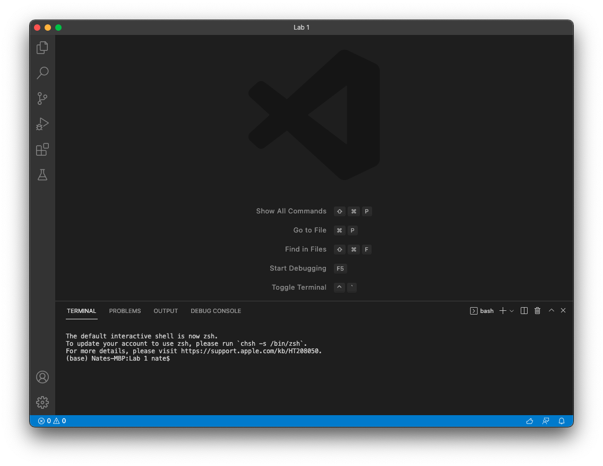

# Lab Report 1 - Week 2

## Using Remote Access

This lab report is about how remote access works and what you can do with remote access.

 

1. Step 1: Installing VSCode

> The first step is to install VSCode. Below is a screenshot of opening VSCode.

