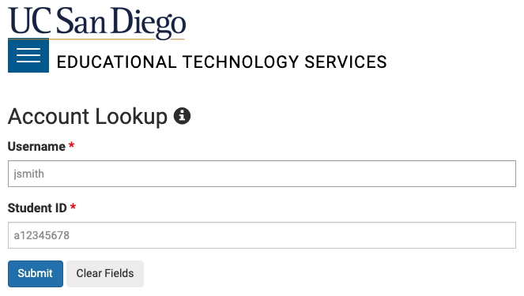
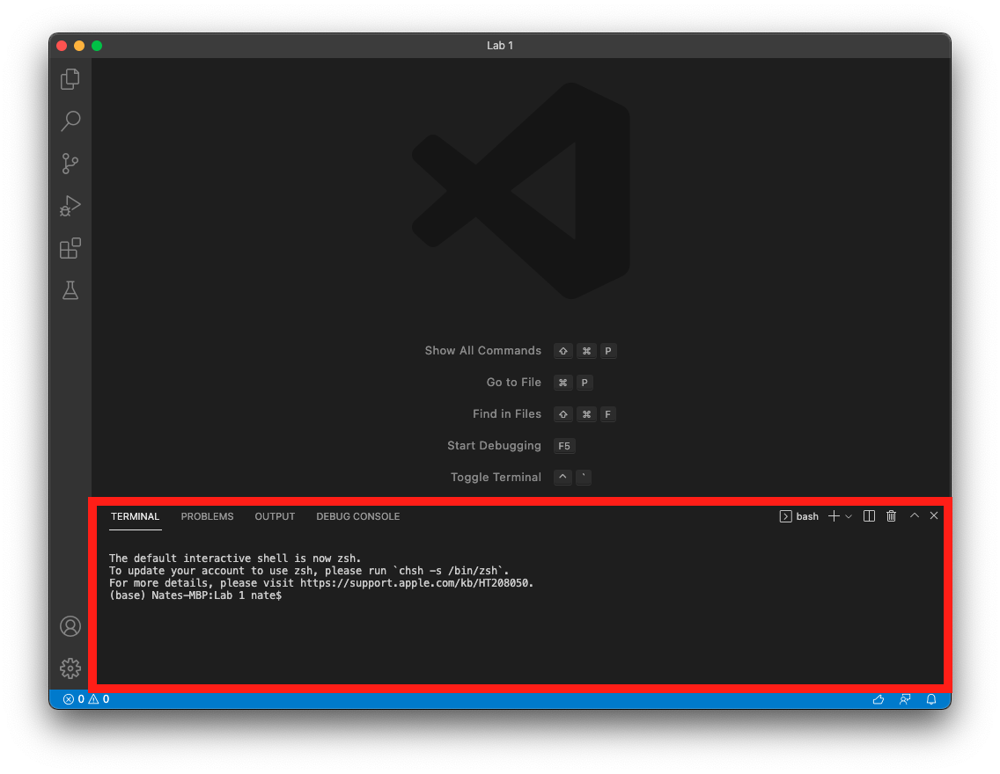
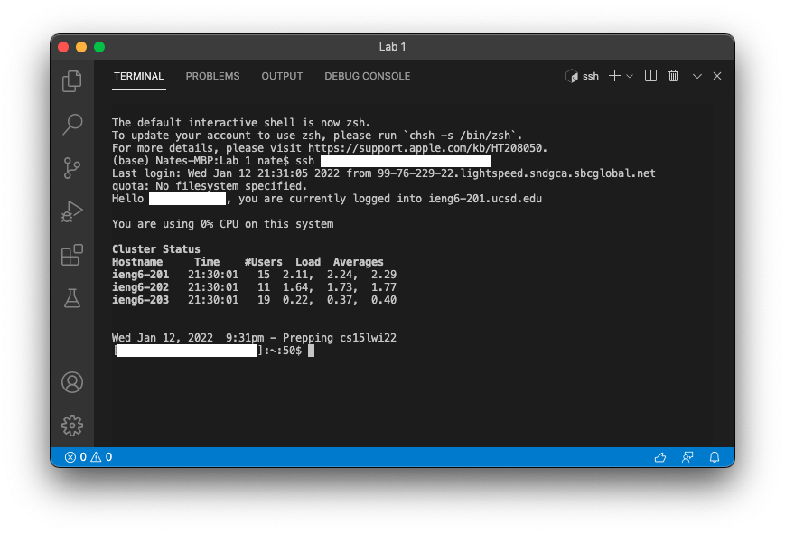
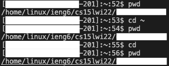
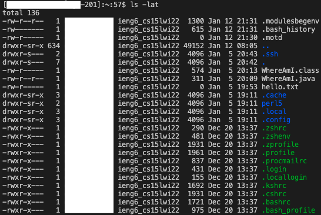
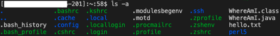
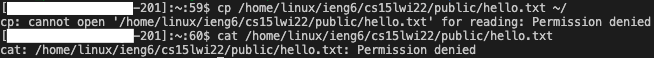
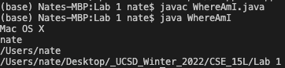
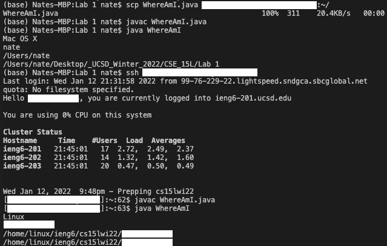

# Lab Report 1 - Week 2

## Using Remote Access

This report goes through how to use Remote Access, including login and use of course specific accounts on external servers. These are the steps I took to familarize myself with the system.

<br>

## Step 1: Download VSCode
---
The first step was to download VSCode in order to access an IDE and a command line. I downloaded the latest version of VSCode for my operating system from the following link. [Download VSCode](https://code.visualstudio.com/download)

Once installed, I opened VSCode and saw the window below. (Note: There may be different colors and different menus, depending on your settings.)


<br>

## Step 2: Find Your Course Specific Account
---
Once VSCode was opened, I moved on to find my student specifc course account to log into the ieng6 servers. I followed this link to search up my account using my username and student ID.

[https://sdacs.ucsd.edu/~icc/index.php](https://sdacs.ucsd.edu/~icc/index.php)



Once my account(s) were found, I clicked on the account that started with `cs15lwi22***`, where the asterisks were my student specific username. In order to activate the account, I first needed to reset my password by following the instructions to the *change your password* link. (Note: It took a while for the password to update, so don't worry if the changes don't go into effect right away.)

After finding my student username and changing my password, I noted it down for my remote connection login later.

<br>

## Step 3: Access the Remote Connection
---

Now that I had my username and password, I went into the terminal available in VSCode. To access the terminal, I opened VSCode, and opened a new terminal using Terminal &#8594; New Terminal in my menu.



In the new terminal at the bottom of my VSCode, I typed in the following command, where the asterisks were my student username for the course.

```
ssh cs15lwi22***@ieng6.ucsd.edu
```

After entering the command, it prompted me to enter my password that I recently changed. It did take a while for my new password to take effect, and the typing out the password does not change anything in the terminal. Don't worry about either, wait a little longer if the password isn't working, and the terminal stores whatever you type in the password field.

Once I successfully logged in, I had access to the remote connection and had a screen like the screenshot below.



<br>

## Step 4: Running Commands Remotely

In my remote connection, I practiced running some terminal commands. A few of the commands I practices are listed below, including their outputs I saw in my terminal.

`pwd` - Returns your current directory path

`cd` - Moves to another directory

`ls` - Lists out files in the current directory







`cp` - Copy file

`cat` - Open file to see its contents



I noticed that there were similar and different behaviors that occured based on what was included after the commands. Both `cd ~` and `cd` returned you to the home directory, which did the same things. `ls -lat` returned a long list format of all files, including hidden files, all sorted by time. `ls -a` only returned a list of all files, including hidden files. Depite being the same command, the arguments I included changed its functionality. I also encountered Permission denied errors when accessing accounts I didn't have access to.

<br>

## Step 5: Moving Files to Remote Connection
---

Next, I copied a file from my local computer to the remote server using the `scp` command. To return back to my local computer, I typed in `logout` (or `exit`) to terminate my connection.

Back in my computer, I made a new Java file `WhereAmI.java` that contained code for printing out a system's property attributes. The code was as folows:

```
class WhereAmI {
  public static void main(String[] args) {
    System.out.println(System.getProperty("os.name"));
    System.out.println(System.getProperty("user.name"));
    System.out.println(System.getProperty("user.home"));
    System.out.println(System.getProperty("user.dir"));
  }
}
```

Returning back to the terminal, I compiled and ran the file on my local computer using `javac` and `java`.



Then I ran the following command to create a copy of the same file to the remote server, where the asterisks was my student username.

```
scp WhereAmI.java cs151wi22***@ieng6.ucsd.edu:~/
```

It prompted me for the same password as my login, and showed me a progress bar of the file copying over to the remote server.



Afterwards, I logged back into the server and compiled and ran the `WhereAmI.java` file on the server instead. This time, the program returned attributes about the server instead of my computer because of where I ran the file.

<br>

## Step 6: SSH Keys