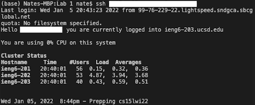

# Lab Report 1 - Week 2

## Using Remote Access

This report goes through how to use Remote Access, including login and use of course specific accounts on external servers. These are the steps I took to familarize myself with the system.

## Step 1: Download VSCode
---
The first step was to download VSCode in order to access an IDE and a command line. I downloaded the latest version of VSCode for my operating system from the following link. [Download VSCode](https://code.visualstudio.com/download)

Once installed, I opened VSCode and saw the window below. (Note: There may be different colors and different menus, depending on your settings.)


## Step 2: Find Your Course Specific Account
---
Once VSCode was opened, I moved on to find my student specifc course account to log into the ieng6 servers. I followed this link to search up my account using my username and student ID.

[https://sdacs.ucsd.edu/~icc/index.php](https://sdacs.ucsd.edu/~icc/index.php)


Once my account(s) were found, I clicked on the account that started with `cs15lwi22***`, where the asterisks were my student specific username. In order to activate the account, I first needed to reset my password by following the instructions to the *change your password* link. (Note: It took a while for the password to update, so don't worry if the changes don't go into effect right away.)

After finding my student username and changing my password, I noted it down for my remote connection login later.

## Step 3: Access the Remote Connection
---

Now that I had my username and password, I went into the terminal available in VSCode. To access the terminal, I opened VSCode, and opened a new terminal using Terminal &#8594; New Terminal in my menu.


In the new terminal at the bottom of my VSCode, I typed in the following command, where the asterisks were my student username for the course.

```
ssh cs15lwi22***@ieng6.ucsd.edu
```

After entering the command, it prompted me to enter my password that I recently changed. It did take a while for my new password to take effect, and the typing out the password does not change anything in the terminal. Don't worry about either, wait a little longer if the password isn't working, and the terminal stores whatever you type in the password field.

Once I successfully logged in, I had access to the remote connection and had a screen like the screenshot below.


## Step 4: Running Commands Remotely
---
In my remote connection, I practiced running some terminal commands. A few of the commands I practices are listed below, including their outputs I saw in my terminal.

`pwd` - Returns your current directory path

`cd` - Moves to another directory

`ls` - Lists out files in the current directory


`cp` - Copy file

`cat` - Open file to see its contents


I noticed that there were similar and different behaviors that occured based on what was included after the commands. Both `cd ~` and `cd` returned you to the home directory, which did the same things. `ls -lat` returned a long list format of all files, including hidden files, all sorted by time. `ls -a` only returned a list of all files, including hidden files. Depite being the same command, the arguments I included changed its functionality. I also encountered Permission denied errors when accessing accounts I didn't have access to.

## Step 5: Moving Files to Remote Connection
---
Next, I copied a file from my local computer to the remote server using the `scp` command. To return back to my local computer, I typed in `logout` (or `exit`) to terminate my connection.

Back in my computer, I made a new Java file `WhereAmI.java` that contained code for printing out a system's property attributes. The code I used is shown below.

```
class WhereAmI {
  public static void main(String[] args) {
    System.out.println(System.getProperty("os.name"));
    System.out.println(System.getProperty("user.name"));
    System.out.println(System.getProperty("user.home"));
    System.out.println(System.getProperty("user.dir"));
  }
}
```

Returning back to the terminal, I compiled and ran the file on my local computer using `javac` and `java`.


Then I ran the following command to create a copy of the same file to the remote server, where the asterisks was my student username.

```
scp WhereAmI.java cs151wi22***@ieng6.ucsd.edu:~/
```

It prompted me for the same password as my login, and showed me a progress bar of the file copying over to the remote server.


Afterwards, I logged back into the server and compiled and ran the `WhereAmI.java` file on the server instead. This time, the program returned attributes about the server instead of my computer because of where I ran the file. An example of the file being copied onto the server and the code running is shown in the screenshot above.

## Step 6: SSH Keys
---
To make my time using the remote connection easier, I set up SSH keys that would allow me to immediately login to the remote connection without having to input a password each time. This would also help when copying files onto the server, as that process also asked for my password each time I used the command.

To set up an ssh key, I entered the following command into my terminal in VSCode.
```
ssh-keygen
```
This generated a public/private rsa key pair that would help me log in faster. The command line prompted me to enter a passphrase, which I left blank, and then confirmed that the identification and public key was saved in my computer's `.ssh` folder.

After generating the public and private keys, named `id_rsa.pub` and `id_rsa` respectively, I copied the public key onto the server's `.ssh` folder. To do this, I started with logging into the remote connection using `ssh`, then making a new directory called `.ssh` using the `mkdir` command. Afterwards, I logged out of the connection and copied the public rsa key to the ssh folder of the server using the `scp` command.

```
$ ssh cs15lwi22***ieng6@ucsd.edu
<Enter Password>
$ mkdir .ssh
$ logout
$ scp file_path_to_id_rsa.pub cs15lwi***@ieng6@ucsd.edu:~/.ssh/authorized_keys
```

> Commands to enter to copy over public rsa key

Once I copied over the public key onto the server, I logged back out and logged back in. Instead of prompting me for my password, it directly logged me in after typing in the `ssh` comand.



## Step 7: Optimizing Remote Running
---
After using the SSH key to make logging in faster, I tried different strategies to make using a remote server easier and faster. The first command I tried was using double quotes to run commands on the server from my local computer.

```
$ ssh cse15lwi***@ieng6.ucsd.edu "enter command"
```

Using the `ls` command in the quotes, I was able to run the `ls` command on the server side, which listed out the folders and files in the home directory.

Next, I tried running multiple commands in one line on my local computer.

```
$ cp WhereAmI.java OtherMain.java; javac OtherMain.java; java WhereAmI
```

This command copied the WhereAmI.java file and named it OtherMain.java, compiled the OtherMain.java file, and ran the WhereAmI file.


The result of this command was that a new file was created called OtherMain.java, but I got an error because the class name of the OtherMain.java file did not match the file name. However, the last command of running the WhereAmI file continued to run.

Finally, I came up with a process that sped up the process of copying over a local file to the server and compiling and running the same file in one line. After changing the code in OtherMain.java so that it worked, I ran the following command:

```
scp OtherMain.java cse15lwi***@ieng6.ucsd.edu:~/; ssh cse15lwi***@ieng.ucsd.edu "javac OtherMain.java; java OtherMain"
```

The following screenshot is the result of the command:


## Wrapup
---
In this report, I went over the process of setting up and using a remote connection, specifically the ieng6 servers at UC San Diego. This process required downloading VSCode, finding my course specific account information, and resetting my password to activate the account. With the terminal in VSCode, I logged into the ieng6 server and copied over different files to compile and run on the server side. Then I tested out some terminal commands on my remote connection. Finally, I optimized my remote connection work efficiency by using SSH keys to avoid constantly entering my password and created a one line command that copied, compiled, and ran a file on the server side from my computer side.