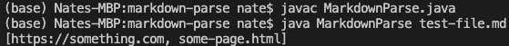
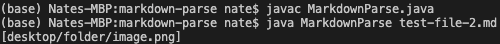
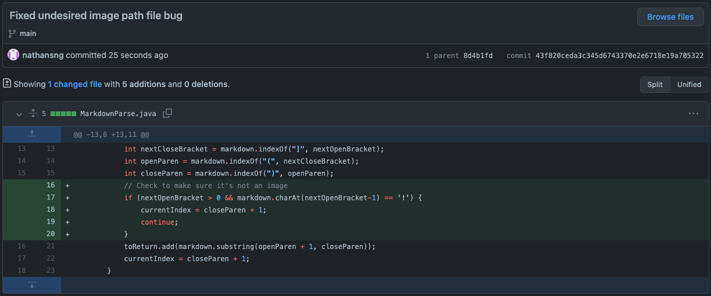
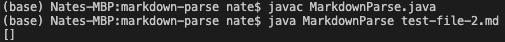

# Lab Report 2 - Week 4

## Debugging Code

This week's report goes through the process of how to debug code and identifying the different aspects of a bug, such as failure-inducing input, bugs, and symptoms. I go through some symptoms I observed when running the code and how I approach fixing the issues.

The code I use in this report is MarkdownParse, which is a Java class containing a function that is meant to extract the url of links in markdown files. While the function works on certain test cases, there are many issues with the code that this report seeks to find and fix. The original repository for MarkdownParse can be found on
ucsd-cse15l-w22's GitHub account. The link to the markdown parse repo can be found here: [markdown-parse repo](https://github.com/ucsd-cse15l-w22/markdown-parse).


## Normal Output
---
The MarkdownParse function is expected to parse a markdown file and extract the url of any embedded links. The idea is to use the locations of the brackets, "[" and "]", and the locations of the following parenthesis, "(" and ")", to find where links might be located. In markdown, the text users would see on the webpage would be contained in the brackets, whereas the actual urls the links lead to are contained within the parenthesis.

Below is the original starting code that can be found in the markdown-parse repo that declares and defines the getLinks function.

```
// File reading code from https://howtodoinjava.com/java/io/java-read-file-to-string-examples/
import java.io.IOException;
import java.nio.file.Files;
import java.nio.file.Path;
import java.util.ArrayList;

public class MarkdownParse {
    public static ArrayList<String> getLinks(String markdown) {
        ArrayList<String> toReturn = new ArrayList<>();
        // find the next [, then find the ], then find the (, then take up to
        // the next )
        int currentIndex = 0;
        while(currentIndex < markdown.length()) {
            int nextOpenBracket = markdown.indexOf("[", currentIndex);
            int nextCloseBracket = markdown.indexOf("]", nextOpenBracket);
            int openParen = markdown.indexOf("(", nextCloseBracket);
            int closeParen = markdown.indexOf(")", openParen);
            toReturn.add(markdown.substring(openParen + 1, closeParen));
            currentIndex = closeParen + 1;
        }
        return toReturn;
    }
    public static void main(String[] args) throws IOException {
		Path fileName = Path.of(args[0]);
	    String contents = Files.readString(fileName);
        ArrayList<String> links = getLinks(contents);
        System.out.println(links);
    }
}
```
> Source: ucsd-cse15l-w22's MarkdownParse repository

The original function is able to do this in certain test cases, such as when there are valid markdown links with no other text following it. Here is an example of a test case that works and the correct output.

```
<!-- Working Test Case, test-file.md -->
# Title

[a link!](https://something.com)
[another link!](some-page.html)
```

The expected output of the above markdown file should be a list containing the two links seen inside the parenthesis.

```
<!-- Expected Output -->
[https://something.com, some-page.html]
```

The following is a screenshot of compiling and running the program on the test-file.md markdown file.



As we can see from the results above, the output matches what we expected to get. However, this is not the case for all markdown files. The following cases show examples of how the code does not cover all test cases and can actually break the code or returns an unexpected output.

## Case 1: Images in markdown
---
One test case that I found that led to an unexpected output was if we add images to the markdown file. Images are added in a very similar style as links, except that an image begins with an exclamation mark (!), such that images would be embedded in the following format: ``. However, the file path used in the image is not a desired output we want to include when we extract links, which is what happened when we ran the original function on files containing markdown images.

The following markdown file is a test that contained a markdown image which was the failure-inducing input. [Link to markdown file](https://github.com/nathansng/markdown-parse/blob/main/test-file-2.md)

```

```

Using the original getLinks function on the failure-inducing input, we get the following output.



In the output, we get a list containing the image path we used to embed the image in markdown. However, the getLinks function is not meant to extract image links. The additional filepath that was returned with the output is the symptom of a bug that results in the unexpected output.

In order to deal with this symptom, I determined that the bug in our code came from a lack of differentiating between images and links in markdown. To determine whether the code was checking an image or a link, I added a check for exclamation points that came before the opening bracket, which indicated that the following was an image. If the code finds an exclamation point followed by a markdown link formatting, then it will skip to the next bracket since we want to avoid images. [Changes to function to avoid including images](https://github.com/nathansng/markdown-parse/commit/43f820ceda3c345d6743370e2e6718e19a705322#diff-c703a0ec03474d601c6bf846740b293e0538bccf38d5f677a302457479e9c652)



The screenshot above shows the code change I committed to address the symptom and fix the bug. After adding the fix, I ran the program again on the same test file and got the expected output of an empty list because there were no links to extract.



In our first case, the symptom we observed was an incorrect output because it included undesired "links". The failure-inducing input that resulted in this symptom was a markdown image. The function I used originally didn't differentiate between markdown images and markdown links and included the file paths of images in the output of links. After looking at the code, I determined that the bug causing this symptom was because there was nothing to check whether it was a markdown image or link. In order to solve this issue, I included code that checked whether there was an exclamation mark before a suppossed markdown link. If there was an exclamation point, then the program would skip the image and move onto the next link.


## Case 2: Non-Link Brackets and Parenthesis
---


## Case 3: Text Beyond Links
---

