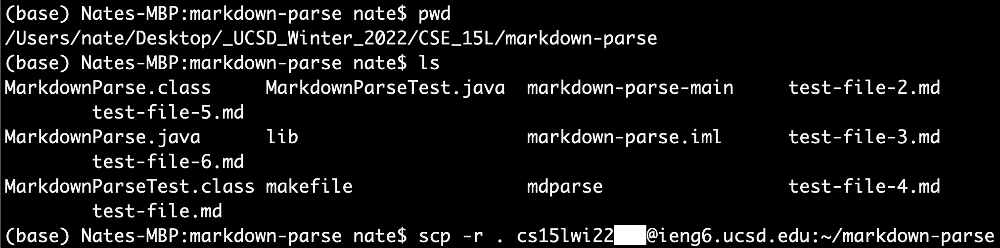
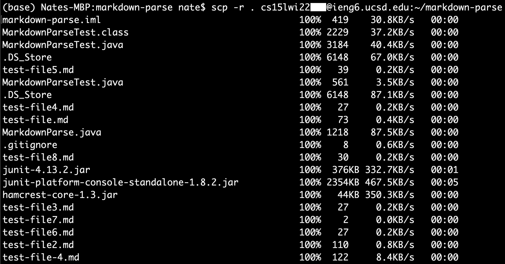
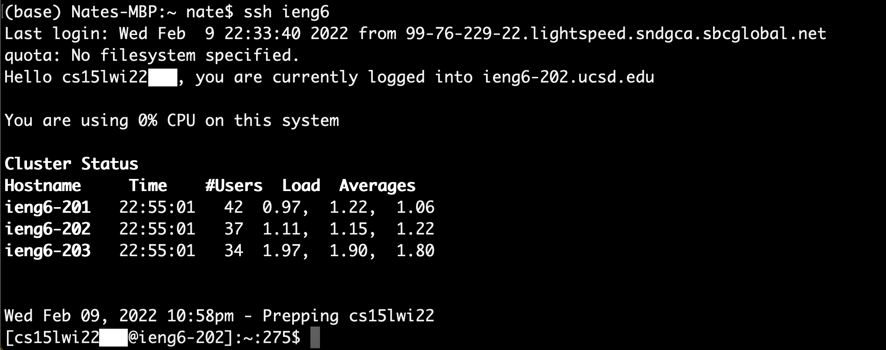
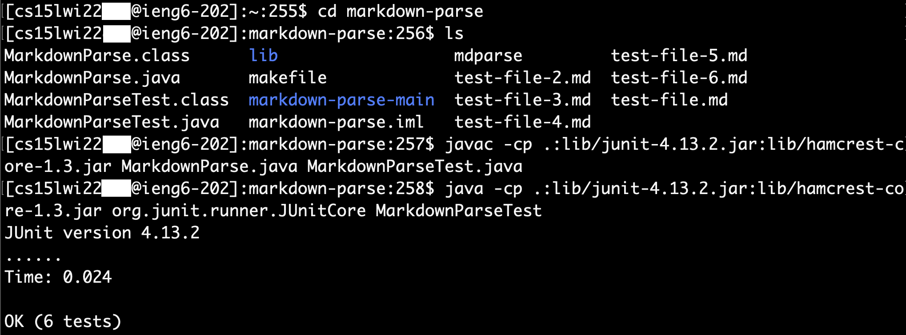

# Lab Report 3 - Week 6

## Copying Whole Directories With `scp -r`

In this week's report, I go through the process and steps of copying entire directories into a remote connection from a local machine. This helps make the programming process and running the code on a remote connection much simpler and more efficient. The main command we'll use is the `scp -r` in the command line, which will copy recursively, from the directory to the files and directories inside it, and so on.

Throughout the report, I use a the GitHub repository, markdown-parse, to copy to the remote connection and run it on the server side. The link to the repository I use can be found here: [Link to repo](https://github.com/nathansng/markdown-parse).

## Part 1: Copying markdown-parse
---
To begin, on my terminal, I went into the directory that I wanted to copy, in this case `markdown-parse`. Then I ran the following code within the directory to copy over the all the contents of `markdown-parse` to a directory called `markdown-parse` on my remote connection.

```
scp -r . cs15lwi22***@ieng6.ucsd.edu:~/markdown-parse
```

The command above tells the computer to copy recursively, all the files in the directory and subdirectories into a folder called markdown-parse on the remote connection. The images below show the command running and a snippet of the results of running the command.


> Running the `scp` command in command line


> Snippet of results of running `scp -r `command

The screenshot above is only a small snippet of the output because this shows the progress of all the files that are copied over to the remote connection. If the directory doesn't have too many files or subdirectories, then the list would be shorter. However, our `markdown-parse` repo has a lot files that I've worked on.

## Part 2: Logging into Remote Connection and Running Tests
---
In the next part, I login to the remote connection and run the test file.



Once I logged into the remote connection, I listed out the items in the current directory. In the red box at the bottom of the screenshot, we can see that `markdown-parse` was properly copied over to the remote connection.



After logging in, I moved into the `markdown-parse` directory and checked its inner contents. All of the files in the folder I copied from my local machine was also copied onto the remote connection. Then I compiled the Java file and tester file, and ran the tester file. The files compile and run without a problem, and we can see that the testers ran into no issues with all tests passed.

## Part 3: Copying and Running in One Line
---
Now that I've shown how to copy entire directories and run files over a remote connection, I'm going to do this whole process in a single command to make the process faster and more convenient.

```
scp -r . cs15lwi22***@ieng6.ucsd.edu:~/markdown-parse; ssh cs15lwi22***@ieng6.ucsd.edu "cd markdown-parse; javac -cp .:lib/junit-4.13.2.jar:lib/hamcrest-core-1.3.jar MarkdownParse.java MarkdownParseTest.java; java -cp .:lib/junit-4.13.2.jar:lib/hamcrest-core-1.3.jar org.junit.runner.JUnitCore MarkdownParseTest"
```

ERRORS: Error running code, seems like code doesn't compile and fails to run. Compile error consists of: cannot find symbol for Path.of(String) and Files.readString(Path). However, if commands to compile and run are ran on the remote connection it works.