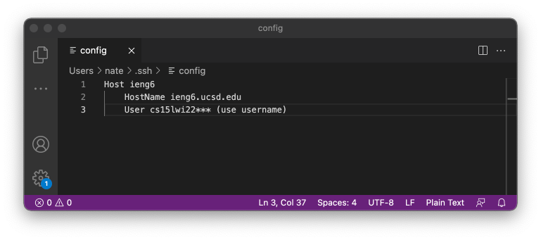
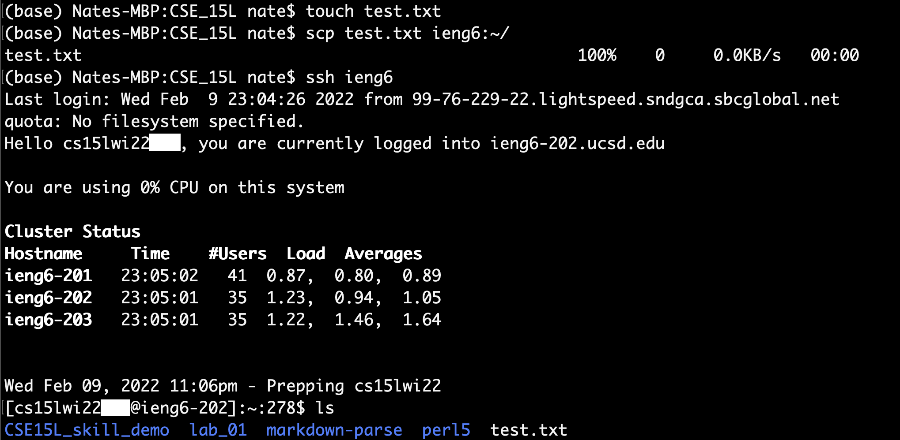

# Lab Report 3 - Week 6

## Streamlining `ssh` Configuration

In this week's report, I go through the process of logging in to the remote connection in a faster and more convenient method. The method of streamling the `ssh` configuration will allow me to interact with the server with a shorter "nickname" compared to the long login username, `cs15lwi22***@ieng6.ucsd.edu`.

## Part 1: Setting up config file
---
To start, I added a config file into the `.ssh` folder that we added our ssh keys into. In the config file I added the following lines:

```
Host ieng6
    Hostname ieng6.ucsd.edu
    User cs15lwi22*** (use username)
```



The screenshot above is when I editted the config file with the lines above using VSCode.

## Part 2: Logging in to Remote Connection
---
Now that I have the config file setup, I test out the easier method of logging into my remote connection. The screenshot below is an example of me logging into the remote connection using the nickname `ieng6` instead of the long username given to me by default.


From the screenshot, I was able to login using just the nickname. This method of streamlining `ssh` makes it more convinent to login and I have to worry less about memorizing or searching up my username to ssh to the remote connection.

## Part 3: Copying Files to Remote Connection
---
After being able to login conveniently, I use this streamline to copy over a file to the remote connection.



The screenshot above shows me creating and copying a test file to the remote connection using the nickname. Then I login to the remote connection to check if the file was copied properly into the remote connection. As expected, I was able to copy over the file using the quicker nickname method.

## Wrap Up
---
This report went over how to streamline the `ssh` process by simplifying the login name to a nickname of our choice, in this case `ieng6`. Not only could we login easily to the server, but we could also copy files using the nickname with ease. This method helps our login and copy files process become quicker and more efficient. It also reduces the chances of any typos or errors in our commands, and allows us to avoid memorizing or constantly searching up our login credentials.