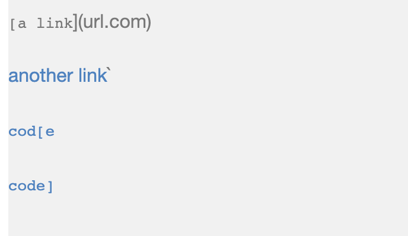
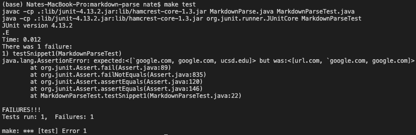
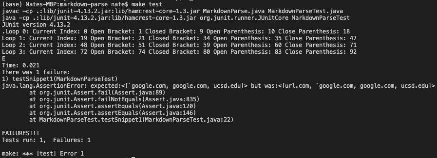
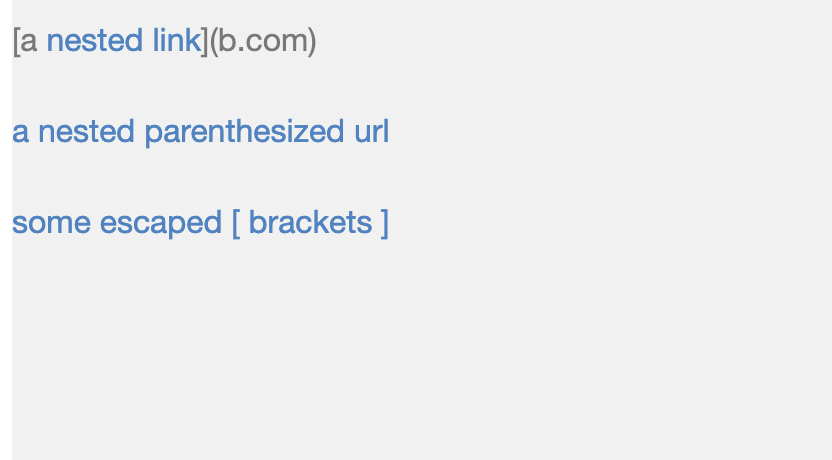
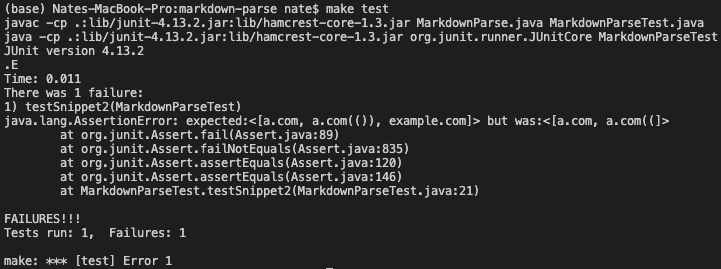
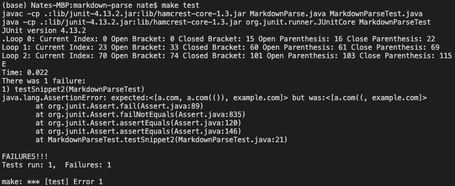
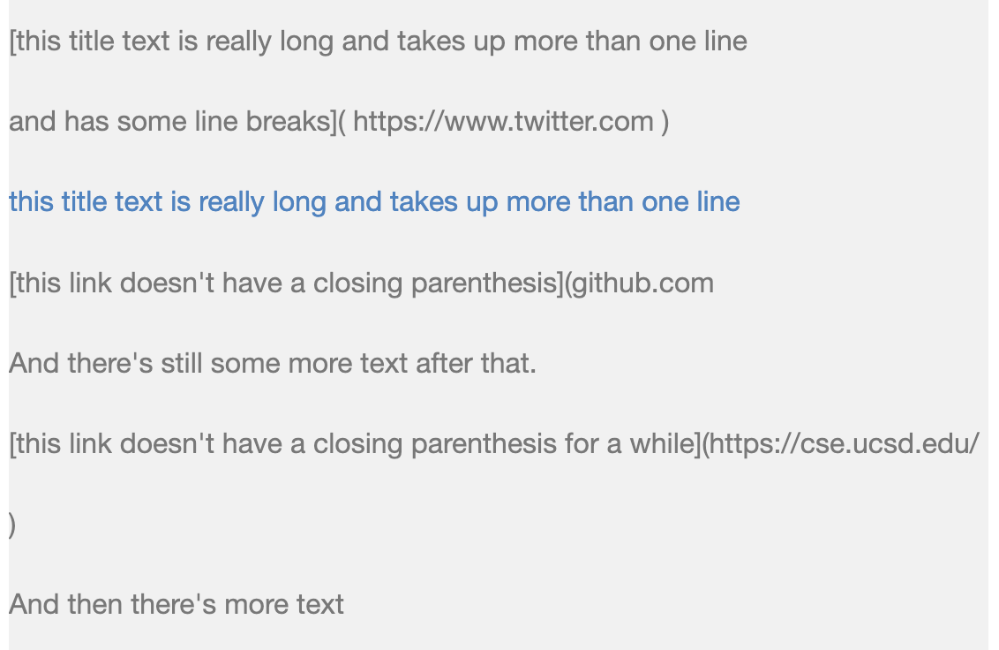
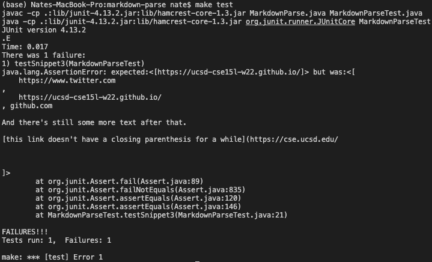
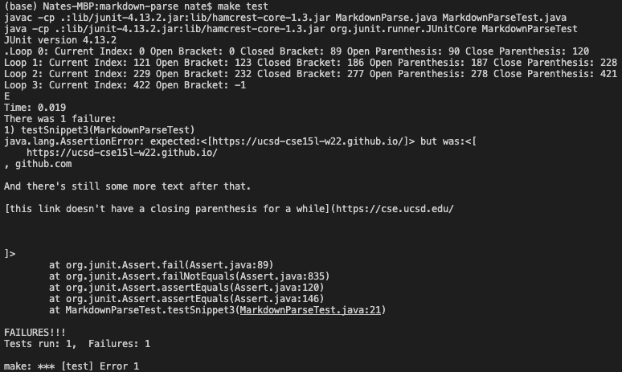

# Lab Report 4 - Week 8

## Testing Different Implementations of MarkdownParse

For this week's report, I test two different implementations of MarkdownParse on three different markdown tests. For each test, I use JUnit to help determine if the tests pass with the implementation and if not, I go over how the code could be changed to work successfully on the test.

The two implementations I use for this report comes from my own GitHub repository and from another user's repository, littlefishy1. Both of the markdown-parse repositories are linked below for reference:

- Nathan's markdown-parse: [https://github.com/nathansng/markdown-parse](https://github.com/nathansng/markdown-parse)
- littlefishy1's markdown-parse: [https://github.com/littlefishy1/markdown-parse](https://github.com/littlefishy1/markdown-parse)


## Test 1: In-Line Code and Links
---
For the first test, the markdown snippet uses inline codes in various places of what would be a valid link. The markdown code and what it would look like are below:

```
`[a link`](url.com)

[another link](`google.com)`

[`cod[e`](google.com)

[`code]`](ucsd.edu)
```
> Markdown Snippet 1


> Visual of Markdown Snippet 1


Based on the output of the markdown file, there are three working links to extract. The expected output would be:

```
[`google.com, google.com, ucsd.edu]
```

Now that we know what to expect from the program, I run both implementations of the getLinks function of MarkdownParse to test if the functions meet the expected values. The JUnit test I use is the following:

```
import static org.junit.Assert.*;
import java.io.IOException;
import java.nio.file.*;
import java.util.*;
import org.junit.*;

public class MarkdownParseTest {
    @Test
    public void testSnippet1() throws IOException {
        String file = Files.readString(Path.of("snippet_1.md"));
        List<String> results = List.of("`google.com", "google.com",
                                        "ucsd.edu");
        ArrayList<String> links = MarkdownParse.getLinks(file);
        assertEquals(results, links);
    }
}
```

In this JUnit test, we read in the file, which contains the markdown snippet and run it through the getLinks method. Then we compare the results we get with a list of the expected results.

### Personal Implementation

First, I run the test using my implementation of MarkdownParse and I get the following output. My implementation failed to extract the correct links and also missed a valid link.



### Other Implementation

Next, I run the test on the other user's implementation and get the following output. Their implementation also failed to extract the expected links and included an invalid link, similar to my implementation.



### Changes Needed to Fix Tests

Based on the markdown file I used to test and the resulting output of my implementation of MarkdownParse, I think there is a simple solution to fix the issue of inline code using back ticks. Since the inline code only seems to affect the square brackets, the solution would be to include code that looks out for the opening and closing inline code markers and ignoring any square brackets within it. However, parenthesis are still valid even within inline code markers, so the code should consider those parenthesis as valid still.

## Test 2: Nested Parenthesis and Brackets in Links
---
In the second test, the markdown code contains nested links, parenthesis, and brackets which result in an interesting output in markdown. The code used for the test is shown below, along with what the markdown would look like:

```
[a [nested link](a.com)](b.com)

[a nested parenthesized url](a.com(()))

[some escaped \[ brackets \]](example.com)
```
> Markdown Snippet 2


> Visual of Markdown Snippet 2

From the visualization of the markdown file, we can expect to extract three link, although maybe not as one would expect. The three links to be extracted are:

```
[a.com, a.com(()), example.com]
```

With the expected values, I test the different implementations to determine if the functions extract the correct links. The JUnit test I use is as follows:

```
import static org.junit.Assert.*;
import java.io.IOException;
import java.nio.file.*;
import java.util.*;
import org.junit.*;

public class MarkdownParseTest {
    @Test
    public void testSnippet2() throws IOException {
        String file = Files.readString(Path.of("snippet_2.md"));
        List<String> results = List.of("a.com", "a.com(())", "example.com");
        ArrayList<String> links = MarkdownParse.getLinks(file);
        assertEquals(results, links);
    }

}
```

### Personal Implementation

Running my implementation on this test, I get the following output. The test failed with my implementation because it wasn't able to extract all the expected links and it failed to correctly extract the nested parenthesis link.



### Other Implementation

Afterwards, I ran the other implementation on the same test and get the following output. Interestingly, this implementation extracted different links but also failed to extract the nested parenthesis link correctly also.



### Changes Needed to Fix Tests

From the results of my function compared to the expected results, there doesn't seem to be a simple solution to deal with nested parenthesis, brackets, and escaped brackets. Since these are all different problems, there would need to be explicit code that handles each situation, such as functions to count the number of open and closed parenthesis to match the correct open parenthesis with the corresponding close parenthesis. There would also need to be some code that also checks if the brackets are escaped brackets or valid brackets, in addition to another function that keeps count of open and close brackets to deal with nested brackets. Overall, there needs to be functions in place to keep track of all the nested parenthesis and brackets, that goes beyond a couple lines of code.


## Test 3: Newlines within Links
---
For this test, the markdown snippet has newlines in between the brackets and parenthesis of markdown links. While some links are considered as valid and displayed properly by markdown, others are not considered valid and the syntax and text are displayed as default text.

The following is the markdown snippet, as well as the visualization of the markdown code:

```
[this title text is really long and takes up more than
one line

and has some line breaks](
    https://www.twitter.com
)

[this title text is really long and takes up more than
one line](
    https://ucsd-cse15l-w22.github.io/
)


[this link doesn't have a closing parenthesis](github.com

And there's still some more text after that.

[this link doesn't have a closing parenthesis for a while](https://cse.ucsd.edu/


)

And then there's more text
```
> Markdown Snippet 3


> Visual of Markdown Snippet 3

In this test case, only one link is displayed as a valid clickable link, while all the other markdown links are displayed as plain text. Based on this visualization, we only expect the following to be the output:

```
[https://ucsd-cse15l-w22.github.io/]
```

The following JUnit test is used to determine if the implementations of MarkdownParse returns the expected values:

```
import static org.junit.Assert.*;
import java.io.IOException;
import java.nio.file.*;
import java.util.*;
import org.junit.*;

public class MarkdownParseTest {
    @Test
    public void testSnippet3() throws IOException {
        String file = Files.readString(Path.of("snippet_3.md"));
        List<String> results = List.of("https://ucsd-cse15l-w22.github.io/");
        ArrayList<String> links = MarkdownParse.getLinks(file);
        assertEquals(results, links);
    }
}
```


### Personal Implementation

For this test, I ran my implementation and got the following output. My implementation also failed in this test because it also extracted invalid "links", or markdown text that follows the format of a markdown link but has some issue in it. Even though it extracted the expected link, it also extracted newline characters attached to invalid links and also a chunk to text because of a missing parenthesis.



### Other Implementation

After running my implementation, I ran the other user's implementation and got the following output. Their implementation of MarkdownParse also failed to extract the correct links, similar to my implementation.



### Changes Needed to Fix Tests

For situations where new lines are in between brackets and parenthesis, there is a small code change that's possible that could fix this issue. It seems that the links don't work only when there's two newlines right next to each other, because the links still work even when there's one new line and text in each line. We can add code to check if there are two newline characters next to each other in between the brackets or the parenthesis, and if there is, then we move onto the next open brackets. This way, it can avoid the links that are made invalid because of the newlines.

## Wrap Up
---
In this lab report, I tested my implementation of MarkdownParse and another user's MarkdownParse on three different markdown files. While all of the implementations failed on all three tests, the first and last test seem to have solutions that are very short because they simply check for something and if it exists, then the code should skip that portion of the markdown file. However, the second test is a bit more challenging because it requires keeping track of nested parenthesis and brackets which might need another function to help keep track. Interestingly, even though both implementations failed in the tests, their outputs differed from each other because of how the function was designed to deal with or not deal with other issues.


