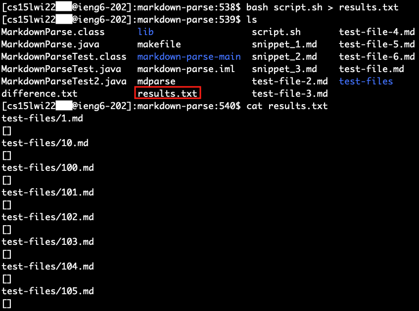
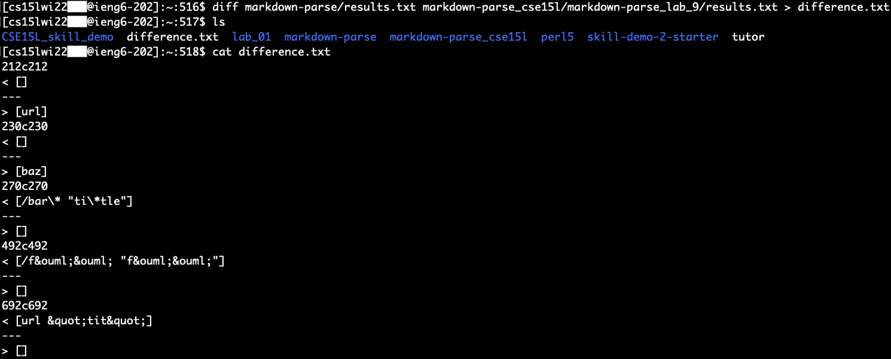
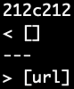
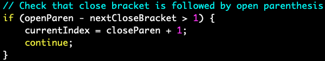
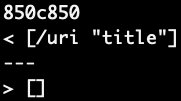
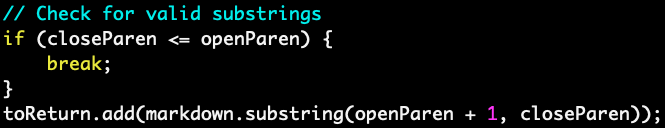

# Lab Report 5 - Week

## Comparing Implementations and Outputs of MarkdownParse

In this week's report, I test my implementation of MarkdownParse against a given implementation of MarkdownParse on several more extensive tests compared to lab report 4. Instead of running each test independently or having to program individual JUnit tests for each file, I use a bash script and a function that allows me to run the implementation on several files at once.

The MarkdownParse implementations I use can be found in the links below:

- Nathan's markdown-parse: [https://github.com/nathansng/markdown-parse](https://github.com/nathansng/markdown-parse)
- ucsd-cse15l-w22's markdown-parse: [https://github.com/ucsd-cse15l-w22/markdown-parse](https://github.com/ucsd-cse15l-w22/markdown-parse)


## Part 1: Running Tests on Implementations
---

Before I can begin comparing outputs, I need to run both implementations on the hundreds of new tests and record their results. To do this, I used a bash script and an additional function to MarkdownParse that runs the getLinks method on all the files in a given repository. All of the test files are in a folder called test-files, and the bash script loops through each file and will output the file name and its list of links.

```
for file in test-files/*.md;
do
    echo $file
    java MarkdownParse $file
done
```

In order to save the output, I use a command to save the results of the function call to a text file for future use. The command and its output file are shown down below.

```
bash script.sh > results.txt
```



After doing this for both implementations of MarkdownParse, I use the command `diff` to identify the differences between the two results files, and I save the differences in a file for future reference. The command and the resulting file is shown below.

```
diff [path_to_results_file] [path_to_second_results_file] > difference.txt
```



The file resulting from the `diff` command shows us all the lines in the files that don't match and a comparison between the two files.

## Part 2: Comparing Results
---

The diff command allows us to see where my implementation may differ from the given implementation of MarkdownParse in a quick and automated way instead of comparing each result manually. With the differences, I take a look at two different test cases that differed in the outputs and determine what the bug is and how to fix it.

### Results of `194.md`

The first problem is on line 212 of the results files. Looking at line 212, the output corresponds to the file `194.md`, which contains the following:

```
[Foo*bar\]]:my_(url) 'title (with parens)'

[Foo*bar\]]
```

From a markdown preview, there is only one valid link in this test case and the expected output should be:

```
[my_(url)]
```

However, we get the following as the output from the two implementations, where my implementation returned an empty list and the other implementation extracted `url`.



Both implementations got the wrong results compared to the expected output.

For my implementation, the bug is when the program checks for the next character after the closing bracket. My code checks if there is a parenthesis right after it, which is not how the link is formated in this case.

Here is the part of the code that needs to be adjusted to accomodate for this case:



Instead of just checking for a parenthesis, it should also look for colons, which is another way links can be formatted. Then it should extract the text in between the colon and whatever whitespace that comes after. In addition, my code should also skip over escaped brackets to avoid the extra closing bracket after `Foo*bar`.

### Results of `481.md`

The next output that differs comes from line 850 in the difference file. This corresponds to file `481.md` in the results file of both implementations. `481.md` contains the following:

```
[link](/uri "title")
```

In this case, there is one valid link and the expected output is:

```
[\uri]
```

Again, both implementations get different results from each other and from the expected output.



This time, my implementaion extracted too much in addition to the valid link, whereas the other implementation didn't extract any links.

In my implementation of MarkdownParse, the bug is from how the code extracts the links. In this case, it's only looking for the text in between the open and close parenthesis of a valid link and extracting all the text in between. This results in extracting the space and "title" in the output.

Here is the part of the code causing the issue:



Instead of just extracting the text in between the open and close parenthesis if they come one after the other, it should also be looking out for link titles. In addition to checking if the open and close parenthesis aren't mismatched, it should also check if there are any whitespace in between the parenthesis. A white space separates the link from the title, and if we set this as the end of the valid link, the code should be able to extract the valid link in this case.

To make the program more robust in case there is an invalid title, which needs to be in between double quotes, then there should be a checker to make sure that there are double quotes surrounding the non-link text. This part of the code could check if there is a double quote after the white space and another double quote before the closing parenthesis after removing any white space in between. If there are no double quotes in any of those areas, then the title is invalid and thus the link is also invalid.

## Wrap Up
---

In this lab report, I tested two implementations of MarkdownParse on several hundred test cases. I used a bash script and the diff commnd to save the results and the difference between results to files. Then I looked into the differences and determined if any of the outputs matched the expected output. If there were outputs that didn't match the expected, then I determined what the bug was and a fix that might help solve the issue for that test case.